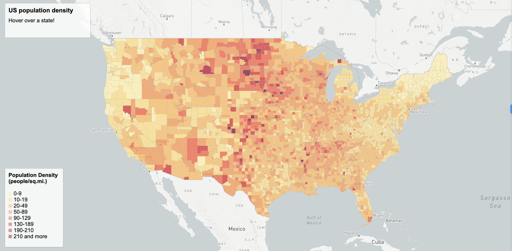
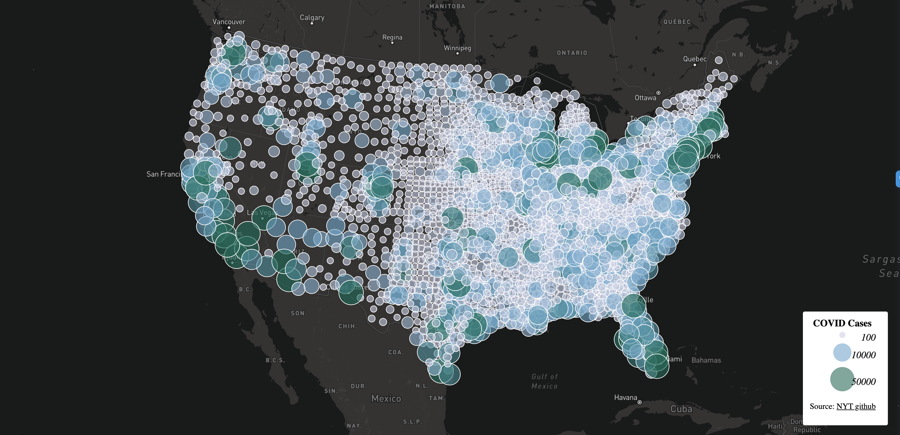

# lab-3

For this lab deliverable we had to design a web map application, and create a github repository to host two thematic maps, one is a choropleth map of the covid-19 rates and the other is a proportional symbols map of covid-19 cases. To plot these maps we obtained all our data from the [New York Times](https://github.com/nytimes/covid-19-data/blob/43d32dde2f87bd4dafbb7d23f5d9e878124018b8/live/us-counties.csv), [2018 ACS 5 year estimates](https://data.census.gov/cedsci/table?g=0100000US.050000&d=ACS%205-Year%20Estimates%20Data%20Profiles&tid=ACSDP5Y2018.DP05&hidePreview=true), and the [US Census Bureau](https://www.census.gov/geographies/mapping-files/time-series/geo/carto-boundary-file.html). After obtaining this data we had to convert these zip files in geojson data with the help of mapshaper.

# Maps

## Chloropleth map of COVID case rates in the US

[Link to Map](maptwo.html)

## Proportional Symbol Map of COVID cases in each county in the US

[Link to Map](mapone.html)

# Acknowledgement

Data was processed by Steven Bao.
